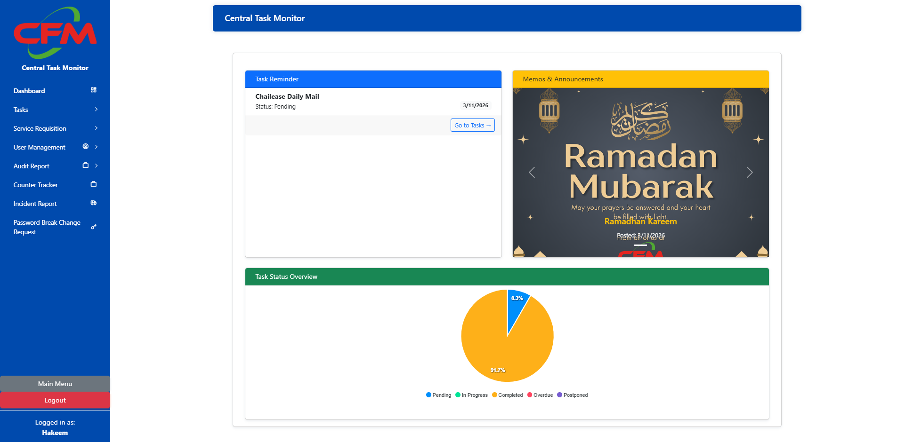
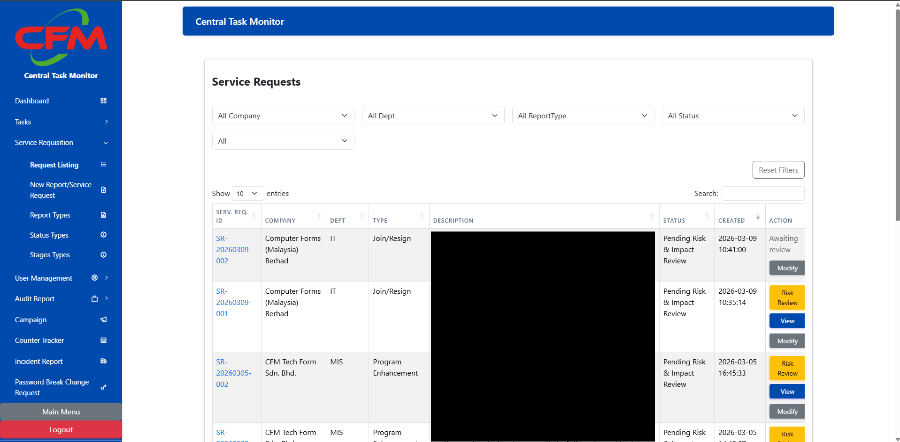
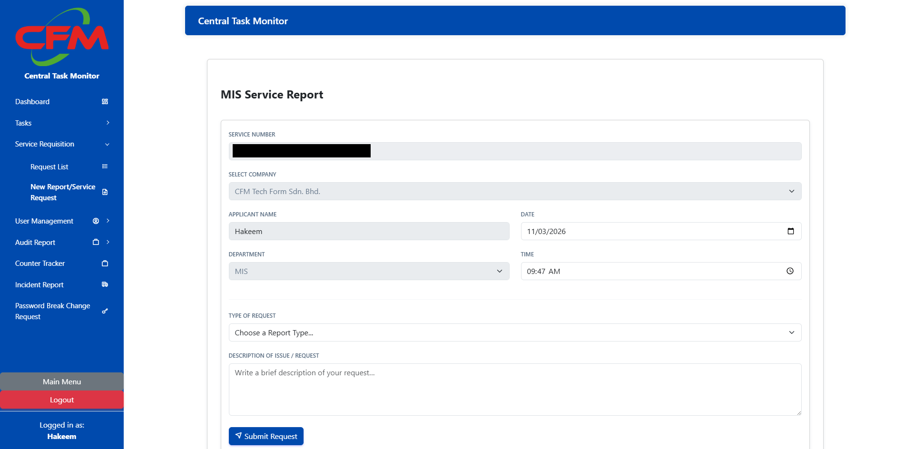
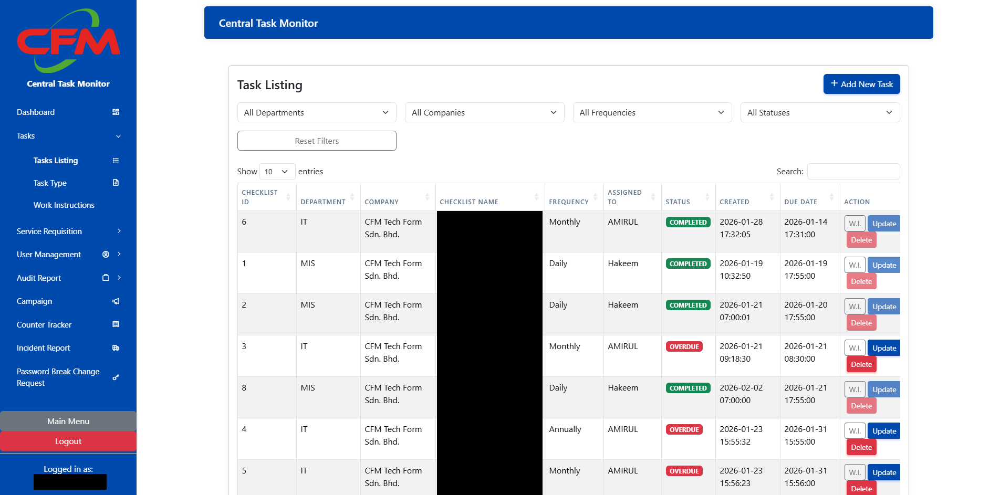
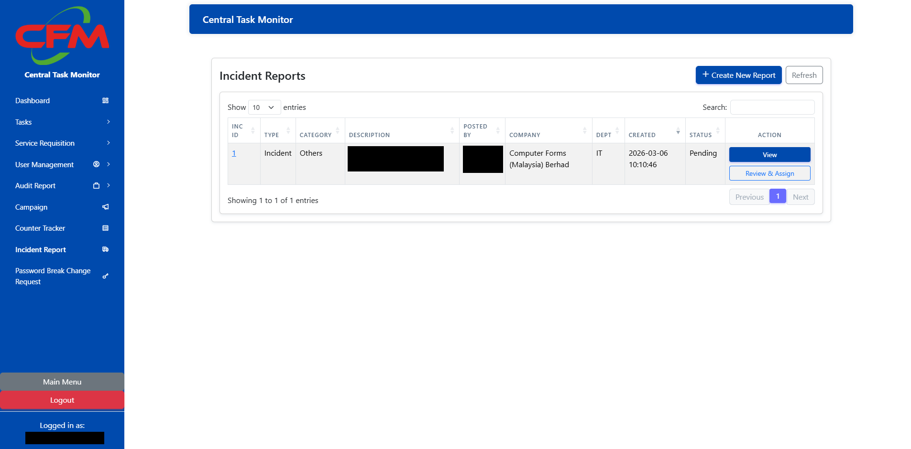
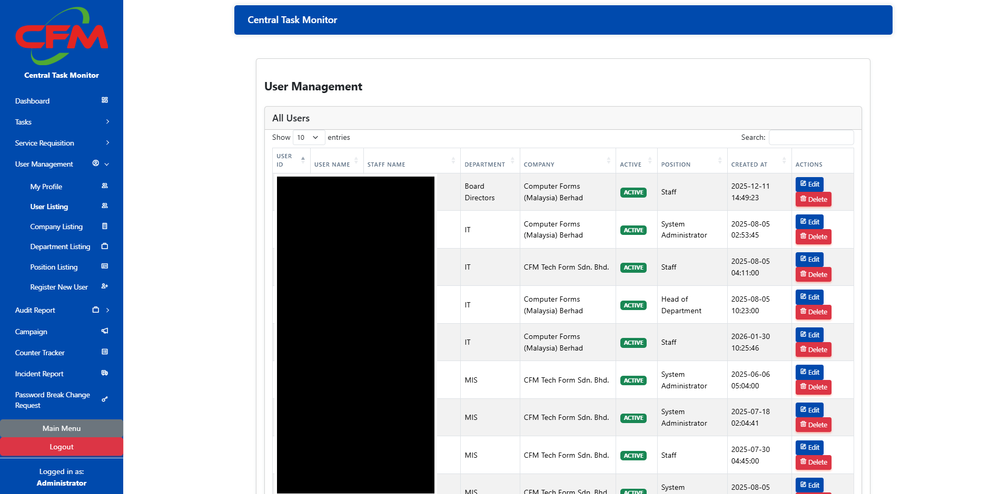

# Central Task Monitor (Showcase)

## Overview

A web-based internal system designed to manage service requests, assign tasks, and track progress across departments.

## Purpose

To replace fragmented manual workflows with a centralized system that improves visibility and coordination.

## Key Features

- Task assignment and tracking
- Status monitoring (Pending, In Progress, Completed)
- Role-based access control
- Reporting dashboard for management
- Incident and complaint reporting system

## Tech Stack

- PHP
- MySQL
- JavaScript (jQuery, AJAX)
- Bootstrap

## My Role

- Designed and developed the system independently
- Built backend logic and database structure
- Implemented frontend UI and interactions
- Integrated workflows and reporting features

## Impact

- Improved operational visibility across teams
- Reduced manual tracking effort
- Enabled structured reporting and accountability

## Screenshots

### Dashboard

A centralized dashboard showing live system activity, task summaries, and operational statistics.

---

### Service Requests

A structured view of submitted service requests for tracking, filtering, and follow-up actions.

---

### Request Form

A digital form used to submit new service requests and replace the previous paper-based process.

---

### Task Management

A task management view used to assign, monitor, and update work across departments.

---

### Incident Reporting

A module for logging and managing incident or complaint reports within the same centralized platform.

---

### User Management

A management screen for handling users and role-based access within the system.

---

## System Flow

User submits request → System validates → Manager approval → Task assigned → Status updates → Completion & reporting

## Challenges & Solutions

**Challenge:** Manual processes caused delays and miscommunication  
**Solution:** Built centralized workflow with real-time updates and role-based access

**Challenge:** Users needed live updates  
**Solution:** Implemented AJAX-based updates without page reloads

**Challenge:** Multiple departments with different needs  
**Solution:** Designed role-based access control system

## Key Design Decisions

- Chose role-based access control to separate responsibilities clearly
- Used AJAX to improve responsiveness without full page reloads
- Structured database to support multi-stage workflows

## Before vs After

Before:

- Paper forms
- Slow approvals
- No real-time updates

After:

- Fully digital workflow
- Faster approvals
- Real-time tracking and visibility

## Testing Approach

- Manual testing of workflow scenarios
- Validation of user roles and permissions
- Edge case testing for request lifecycle

## Project Structure (Conceptual)

- Frontend (UI & interactions)
- Backend (business logic)
- Database (data storage)
- API layer (communication)

**Features:** Workflow System · Role-Based Access · Reporting · Real-Time Updates

## Future Improvements

- Migrate to modern frontend framework (React/Vue)
- Improve performance with caching
- Add notification system (email/push)
- Introduce API-first architecture

## Note

Source code is private due to company confidentiality.
